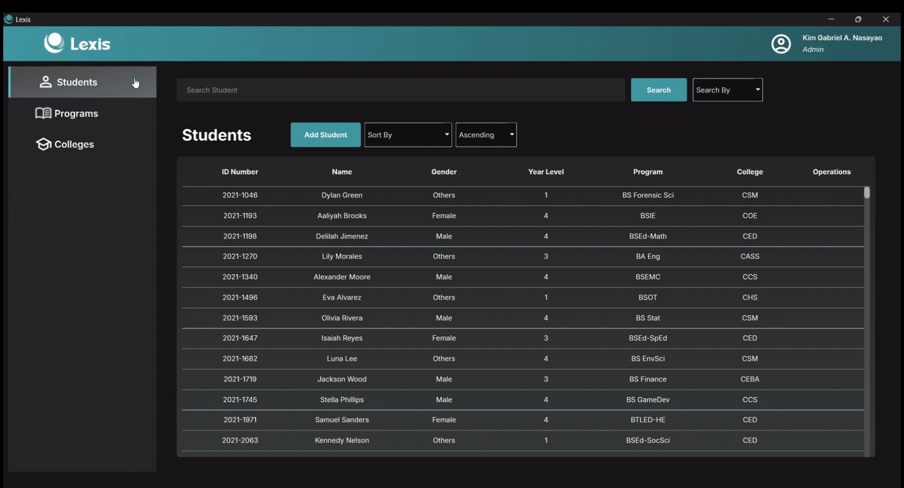
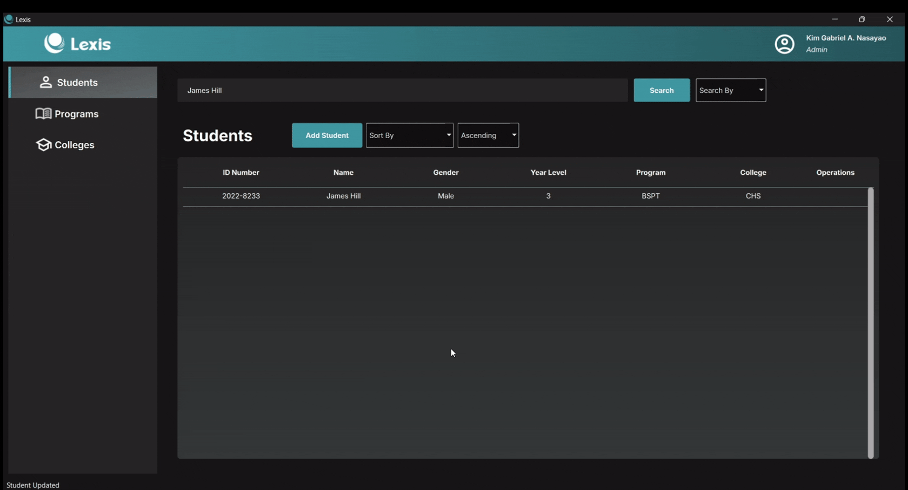
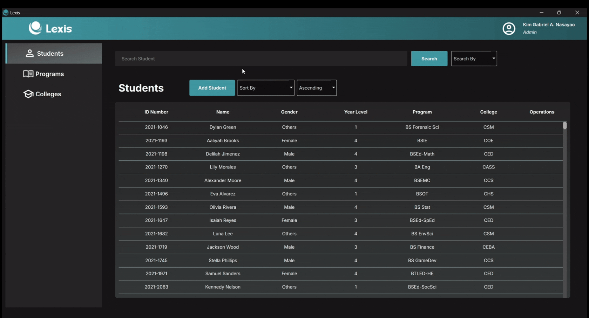
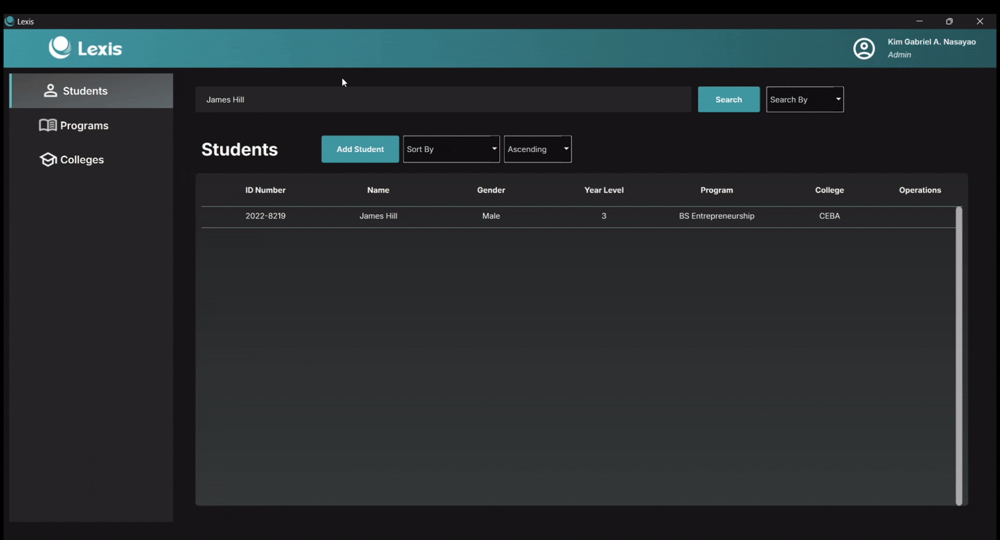
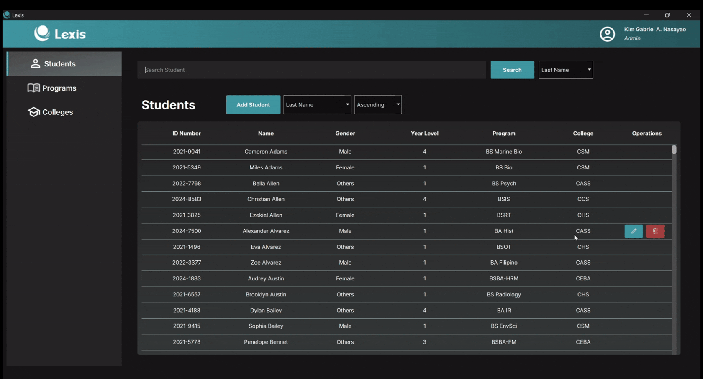

<h1>
  
  Lexis - a Student Information System
</h1>

This project is developed in fulfillment of the requirements for the subject **CCC151 - Information Management Systems**.

<br></br>
## About This Project

Lexis is a student information system built using Python, PyQt6, and using CSV data storage **without a DBMS**. It provides full CRUDL capabilities, including features such as **sorting**, **searching**, and **unique ID management**.

<br></br>

## **Features**
- Store **STUDENT**, **PROGRAM**, and **COLLEGE** records for any University
- **ADD**, **EDIT**, and **DELETE** records
- **SORT** and **SEARCH** records by multiple fields  
- Intuitive **PyQt6** UI  
- **CSV**-based database (lightweight storage)  

<br></br>

#### **STUDENT**, **PROGRAM**, and **COLLEGE** pages. 
These three sections allow you to search, sort, add, edit, and delete records efficiently. You can navigate between these pages to manage student information, academic programs, and college details.


#### **ADDING a record**. 
To add a new record, navigate to the respective section (Student, Program, or College), click the "Add" button, and fill out the necessary fields in the form. Once submitted, the new entry will appear in the table.


#### **SEARCHING for records**. 
The search feature allows you to quickly find specific records. You can filter results by entering a search term in the search bar. The system will match records based on all available fields unless you specify a particular search field in the "Search By" dropdown.


#### **SORTING records**. 
You can organize the data by sorting records based on their attributes. Choose an attribute (e.g., Last Name, ID Number, or College) and toggle between ascending or descending order to rearrange the list accordingly.


#### **UPDATING a record**. 
To modify an existing record, click the Edit Button signified by a "Pen" that appears at the end when hovering over the record you selected. A form will appear, allowing you to update the necessary fields. After saving, the changes will reflect immediately in the database.


#### **DELETING a record**. 
If you need to remove a record, click the Delete Button siginified by a "Trash Can" that appears at the end when hovering over the record you selected. A confirmation prompt will appear to prevent accidental deletions. Once confirmed, the record will be permanently removed.

___

<br></br>

## **Setup Instructions**

### **1. Clone the Repository**

```sh
git clone https://github.com/gabnash05/CCC151-SSIS.git
cd CCC151-SSIS
```
### **2. Create and Activate a Virtual Environment**
- **Windows Command Prompt:**
  ```sh
  python -m venv ssis_env
  ```
- **Linux/macOS:**
  ```sh
  source venv/bin/activate
  ```
You’ll see (venv) appear in the terminal, indicating that you're inside the virtual environment.

### **3. Activate the Virtual Environment**

- **Windows Command Prompt:**
  ```sh
  ssis_env\Scripts\activate
  ```

- **Windows Powershell:**
  ```sh
  .\ssis_env\Scripts\Activate
  ```

- **Linux/macOS:**
  ```sh
  source ssis_env/bin/activate
  ```

### **4. Install Dependencies**

```sh
pip install -e .
```
This installs all required dependencies including PyQt6 and any other libraries listed in `requirements.txt`
___

<br></br>

## **Running the Project**

Make sure the virtual environment is activated and all dependencies were installed properly
```sh
python -m main
```
<br></br>

## **Deactivating the Virtual Environment**

When you're done working, deactivate the virtual environment:
```sh
deactivate
```

<br></br>

## **Troubleshooting**

If `pip install -e .` fails, try manually installing dependencies using:
```sh
pip install -r requirements.txt
```

If `pip install -r requirements.txt` fails, try updating `pip`:
```sh
pip install --upgrade pip
```

<br></br>

## **License**
This project is for educational purposes only.